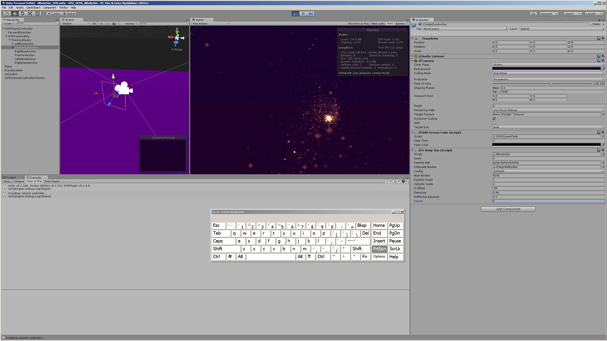

#GPU Gems to Unity(5) - VR Experiments

A repo of simple Unity VR experiments using existing GPU Gems code. 

**Credit:** [ScrawkBlog](http://scrawkblog.com), [NVIDIA Developer Zone](https://developer.nvidia.com/)

For now this repo only consists of one Unity 5 project, but I might add more in the future.

##1. NBodySim

[Click here to view a Youtube video of this project in action...](https://www.youtube.com/watch?v=UKTLrZ07qpQ)

### Requirements

* Unity v5 +
* Oculus SDK v0.8.0.0

**Note:** Technically this project will run without a HMD, but that kind of defeats the purpose. :P

### Setup / Running

1. Clone this repo

2. Open GPU_GEMS_NBodySim in Unity 5+

3. Goto Scenes > NBodySim

4. Click Play

**Note** NBodySim script is the main effect script and is attached to the OVR Camera.
` Hierarchy > OVRPlayerController > OVRCameraRig > CenterEyeAnchor `

### Backstory

* Originally inspired by [Chapter 31 of NVIDIA's GPU Gems 3](http://http.developer.nvidia.com/GPUGems3/gpugems3_ch31.html) (Mar 16, 2007)

* Original source code provided by Justin Hawkins from his ScrawkBlog post, [GPU gems to Unity: NBody simulation](http://scrawkblog.com/2014/02/07/gpu-gems-to-unity-nbody-simulation/) (February 7, 2014)

* November 21, 2015: I updated Scrawk's project files to work with the Oculus Rift DK2
 * Updated Project to **Unity v5.2.2p4**
 * **OVR v0.1.4.0** utilities package added to the project
 * **InControl (version 1.4.4 build 3824)** package added to the project
    * Control player's Y-axis movement using RightStickY on a gamepad controller OR using `Z` and `C` keyboard keys
 * Added Z Offset param to *N Body Sim* Script, in order to give the player view some padding distance from the particles origin (originally the particles would end up swarming directly around the player camera and would be too close for an enjoyable stereoscopic effect...)

### Completed
* Test to see if this code would run at a reasonable framerate with decent stereoscopic effect on DK2. **[Success]**

###Future Work

* **Real-time Sim Controls** I'd like to add some on-screen controls for the simulation such as particle count, speed, damping, etc. To allow you to manipulate the simulation while it's running
* **Advanced Particle Effects** I'd like to play around with changing particle attributes like color depending on velocity and nearest neighbors
* **Real-time Interaction** Would like to experiment with some kind of interaction either using mouse or (once I have access to them) a touch input controller like Oculus' Half Moon Prototype or the HTC Vive Controllers
